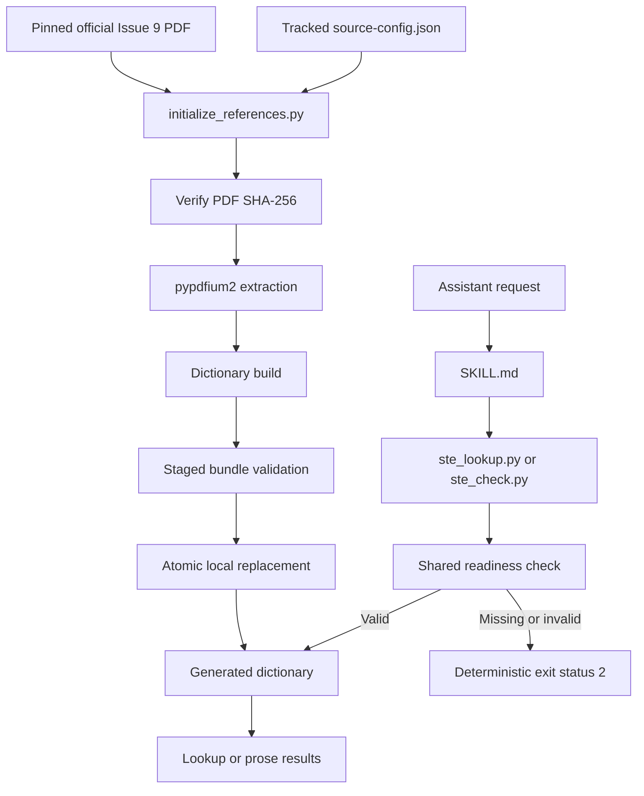

# ASD-STE100 Writer skill

`write-asd-ste100` is a private skill for technical English, for use with Codex and Claude Code. It uses the ASD-STE100 Issue 9 writing rules and a locally generated dictionary. Git does not contain the extracted dictionary or its generated validation metadata.

The skill helps an assistant draft, revise, and examine procedures, descriptions, documentation, comments, docstrings, release notes, and user-facing technical text. It keeps code, identifiers, commands, paths, quotations, diagnostics, and established project terminology without changes.

## Install

This skill does not use a harness skill installer or a plugin marketplace. Do not install it through a Claude Code plugin command or an equivalent Codex feature. It is not a Claude Code plugin, so it has no `.claude-plugin/plugin.json` manifest.

Install this skill through a plain clone and a symlink. Clone the repository to one location that is independent of every harness. Then create one symlink per harness that points at that clone. Neither harness manages or copies this clone. See `INSTALL.md` for the complete procedure, including the exact clone location, the symlink command for each harness, and verification.

### Prerequisites

Runtime lookup and checking (`ste_lookup.py`, `ste_check.py`, `validate_references.py`) use only
the Python 3 standard library, on macOS or Linux, no install step needed.

Reference initialization (`initialize_references.py`, one-time, and again after
`references/source-config.json` changes) additionally needs the `pypdfium2` package, on macOS or
Linux, x86_64 or arm64. Install it into a virtual environment rather than a system Python, since a
system `python3` (as shipped by macOS) is not meant to receive `pip install`s directly:

```sh
python3 -m venv .venv
.venv/bin/pip install pypdfium2
```

Then use `.venv/bin/python` in place of `python3` for the initialization commands below. Runtime
commands do not need the virtual environment.

### Initialize

After you clone the repository, initialize the local reference bundle:

```sh
python3 scripts/initialize_references.py
```

(or `.venv/bin/python scripts/initialize_references.py` if you installed `pypdfium2` into a venv,
per Prerequisites above)

The default command downloads the pinned official Issue 9 PDF to a temporary directory. It verifies the PDF SHA-256 before extraction. It then extracts and validates the dictionary before it replaces `references/generated/`. The command removes the downloaded PDF and intermediate geometry when it finishes.

To use a local copy of the pinned PDF, run this command:

```sh
python3 scripts/initialize_references.py --pdf ASD-STE100_ISSUE9.pdf
```

Use `--force` to rebuild a bundle that is already valid:

```sh
python3 scripts/initialize_references.py --force
python3 scripts/initialize_references.py --pdf ASD-STE100_ISSUE9.pdf --force
```

## Harness support

One clone serves both harnesses. Each harness reads the same tracked files and the same generated reference bundle through a symlink, not through a harness install feature.

| Harness | Symlink target | Interface manifest | Ask-user API |
| --- | --- | --- | --- |
| Codex | `~/.codex/skills/write-asd-ste100` | `agents/openai.yaml` | `request_user_input` |
| Claude Code | `~/.claude/skills/write-asd-ste100`, or a project's `.claude/skills/` | none | `AskUserQuestion` |

The symlink target column names the path where each harness expects to find the skill. That path is a symlink to the clone, not a copy that a harness installer created and manages.

`agents/openai.yaml` is a Codex-only interface manifest. It sets the display name, short description, and default prompt that Codex shows for this skill. Claude Code reads the `name` and `description` fields from the `SKILL.md` frontmatter directly, so it needs no equivalent manifest.

## Architecture

The repository has a tracked configuration path and a local generated-data path. The runtime path always validates generated data before use.



### Tracked data

Git contains `references/writing-rules.md` and `references/project-terminology-schema.md`. Git also contains `references/source-config.json`. The source configuration pins the official URL, PDF SHA-256, Issue 9 identity, page geometry, expected row counts, and expected dictionary SHA-256.

The writing-rule summary covers the 53 Issue 9 rules and eight general recommendations. It does not replace the official standard.

### Generated data

The initializer creates these local files:

```text
references/generated/
├── dictionary.jsonl
├── dictionary-validation.json
└── manifest.json
```

The complete directory is ignored by Git. `dictionary.jsonl` contains the extracted part-of-speech records. `dictionary-validation.json` records the source identity, expected counts, reconciliation data, and dictionary hash. `manifest.json` binds both generated files to the tracked source configuration with hashes and byte counts.

The initializer builds a staged directory first. It replaces the installed generated directory only after the staged bundle passes all validation. A download, hash, extraction, build, or validation failure leaves the installed bundle unchanged.

## Automatic runtime validation

Each public runtime command calls the same readiness function before it reads reference data:

```sh
python3 scripts/ste_lookup.py WRITE
python3 scripts/ste_check.py document.md --mode descriptive --json
python3 scripts/validate_dictionary.py
```

Do not run a separate readiness preflight for a lookup or check. Call the required command once. A valid bundle permits the requested operation to continue.

A missing, incomplete, stale, or modified bundle returns exit status 2. The error gives all data that the assistant needs for initialization. It includes a stable code, the failed condition, the absolute generated-data path, and the exact initialization command. It also includes the online requirement, pinned URL, and Issue 9 identity. Commands that use `--json` return the same error as structured JSON. These failures do not include a Python traceback.

The standalone diagnostic command remains available for installation checks:

```sh
python3 scripts/validate_references.py
python3 scripts/validate_references.py --json
```

`validate_references.py` is not a prerequisite for the other commands.

## Integrity checks

Readiness validation checks all of these conditions:

- The generated directory and its three required files exist.

- The manifest and validation metadata have complete schemas.

- The generated source identity matches the tracked Issue 9 identity.

- The source-configuration hash matches the tracked configuration.

- Generated file sizes and SHA-256 values match the manifest.

- The dictionary SHA-256 matches the pinned expected value.

- Each dictionary row has the required fields and valid values.

- Source pages, row counts, source anchors, and declared counts reconcile.

Runtime commands never download data. After initialization, lookup, checking, and diagnostics work without a network connection. The `--pdf` initializer also works without a network connection when the local PDF matches the pinned hash.

## Runtime commands

Look up a word:

```sh
python3 scripts/ste_lookup.py WRITE
python3 scripts/ste_lookup.py clean --part-of-speech v --json
```

Check one or more explicit files, or standard input:

```sh
python3 scripts/ste_check.py document.md --mode descriptive
python3 scripts/ste_check.py overview.md procedure.md --mode procedural --terms STE_TERMS.jsonl
printf 'Use the tool.\n' | python3 scripts/ste_check.py - --mode procedural --json
python3 scripts/ste_check.py document.md --mode descriptive --layers software
```

Every invocation is a batch. A one-file invocation is a batch with one item. Give every filesystem path explicitly. The checker does not traverse directories, expand globs, or discover files. Use `-` for standard input only when it is the sole input.

Use `--layers` to select which vocabulary layers the checker applies, as a comma-separated list drawn from `asd`, `software`, `project`. The default is all three layers, so a plain invocation matches prior output. The `software` layer flags overused AI-coding-assistant words and phrases at `review` severity, in category `overused_term`, and never contributes to a `fail` outcome. Pass `--layers software` alone to review overused-term findings apart from unknown-term noise from the base dictionary. Each finding and lookup match states the layer that produced it, in an `evidence.source` value of `asd_ste_terms`, `software_terms`, or `project_terms`.

The checker validates the generated reference bundle once before it validates inputs. It validates and reads every requested input before it analyzes any file. If an input is missing, is not a regular readable file, has invalid UTF-8, or cannot be read, the checker emits only input-read diagnostics and returns status 2. It does not emit a partial report for readable files in that batch. After successful input validation, it loads the dictionary and any `--terms` data once, then reuses them for every file.

An LLM uses `--json` when it runs the checker. Successful JSON output always contains one batch envelope and ordered per-file reports:

```json
{
  "mode": "descriptive",
  "outcome": "pass",
  "summary": {
    "files": 1,
    "passed_files": 1,
    "review_files": 0,
    "failed_files": 0,
    "total": 0,
    "errors": 0,
    "warnings": 0,
    "reviews": 0,
    "unique_unknown_terms": 0
  },
  "files": [
    {
      "path": "document.md",
      "outcome": "pass",
      "summary": {
        "total": 0,
        "errors": 0,
        "warnings": 0,
        "reviews": 0,
        "unique_unknown_terms": 0
      },
      "findings": []
    }
  ]
}
```

Each file item has its supplied path, outcome, summary, and findings. Offsets are zero-based within that file. Lines and columns are one-based. End positions are exclusive. Findings are in source order. Errors occur before warnings and reviews when findings start at the same position. The checker assigns identifiers after it sorts each file's findings. Aggregate `unique_unknown_terms` counts different normalized terms across the batch.

The `fail` outcome means that a readable file has one or more deterministic errors, and the process returns status 1. The `review` outcome means that a readable file has only heuristic or terminology findings, and the process returns status 0. The `pass` outcome means that a readable file has no findings, and the process returns status 0. Each unknown-term occurrence has a finding. A readable file with `fail` is a completed analysis result. It is not an input failure.

Plain-text output prints a visible `File: PATH` section for every analyzed file, that file's ordered findings, and its `Outcome: pass`, `Outcome: review`, or `Outcome: fail`. It then prints one aggregate summary with file and finding counts. This format also applies to a one-file batch.

Status 2 means the invocation could not complete. Invalid references retain their existing initialization diagnostic. Invalid arguments use `invalid_arguments`. Invalid terminology data uses `terms_invalid`. Unreadable input uses `input_read_failed`, for example:

```json
{
  "error": {
    "code": "input_read_failed",
    "inputs": [
      {"path": "missing.md", "condition": "file does not exist"}
    ]
  }
}
```

The checker does not change input text. The assistant examines actions and candidates, keeps the intended meaning, and revises prose.

## Project terminology

A repository can include `STE_TERMS.jsonl` for approved project terminology. Pass this data to the checker with `--terms`. Each entry identifies a `technical_noun` or `technical_verb` and can include approved forms, a meaning, and a source.

See `references/project-terminology-schema.md` for the complete format. Do not use terminology overrides for general prose words.

## Software terminology

`references/software-terminology.jsonl` is a hand-curated, git-committed denylist of overused AI-coding-assistant words and phrases, with a preferred human alternative for each. It supplies software-domain specifics for Rule 1.10 and Rule 1.1. It carries no approved wordlist, only unapproved entries.

See `references/software-terminology-schema.md` for the complete format, the entry fields, and the two rules that keep an entry from misfiring on legitimate software terms.

## Maintenance implementation

`extract_dictionary.py` reads the tracked page geometry and uses `pypdfium2`. It isolates the four dictionary columns and emits character-level geometry as temporary JSONL data.

`build_dictionary.py` converts geometry records into dictionary records. It joins wrapped headwords, handles page continuations, collects approved forms, and preserves examples and source identifiers.

`initialize_references.py` controls source acquisition, extraction, build, validation, cleanup, and local installation. Direct extractor and builder use is for development only. Normal setup uses the initializer.

## Tests

The tests are not distributed with the plugin. They live in `tests/write-asd-ste100/` at the
repository root. Run them from a clone of the repository:

```sh
python3 -m unittest discover -s tests/write-asd-ste100 -v
```

Unit tests use synthetic dictionary records. They do not reproduce the ASD word list. Dictionary integration tests run only when a valid local generated bundle exists.

The tests cover valid bundles, missing files, incomplete manifests, wrong hashes, and stale source identities. They also cover malformed dictionaries, structured errors, runtime network blocks, and initializer recovery.

## Directory layout

```text
write-asd-ste100/
├── .gitignore
├── SKILL.md
├── README.md
├── INSTALL.md
├── agents/
│   └── openai.yaml
├── references/
│   ├── generated/                  # Local and ignored
│   │   ├── dictionary.jsonl
│   │   ├── dictionary-validation.json
│   │   └── manifest.json
│   ├── project-terminology-schema.md
│   ├── source-config.json
│   └── writing-rules.md
└── scripts/
    ├── build_dictionary.py
    ├── extract_dictionary.py
    ├── initialize_references.py
    ├── ste_check.py
    ├── ste_data.py
    ├── ste_lookup.py
    ├── validate_dictionary.py
    └── validate_references.py
```

The test suite lives outside the plugin, at `tests/write-asd-ste100/test_ste_tools.py` in
the repository, so it is not copied into a plugin install.

## Scope limits

The checker is an aid for a writer with STE training. It cannot make sure that technical meaning is correct. It also cannot infer all part-of-speech values, find all passive constructions, or resolve all technical terms. Correct technical content and established project terminology are more important than a general vocabulary replacement.

Use `STE-compliant` only after lexical, mechanical, and semantic inspection confirms the text against Issue 9. Otherwise, use `STE-aligned` or `checked against the bundled Issue 9 data`.

ASD owns ASD-STE100 Simplified Technical English and its registered trademark. This private skill is not endorsed, certified, or authorized by ASD or the ASD Simplified Technical English Maintenance Group.
